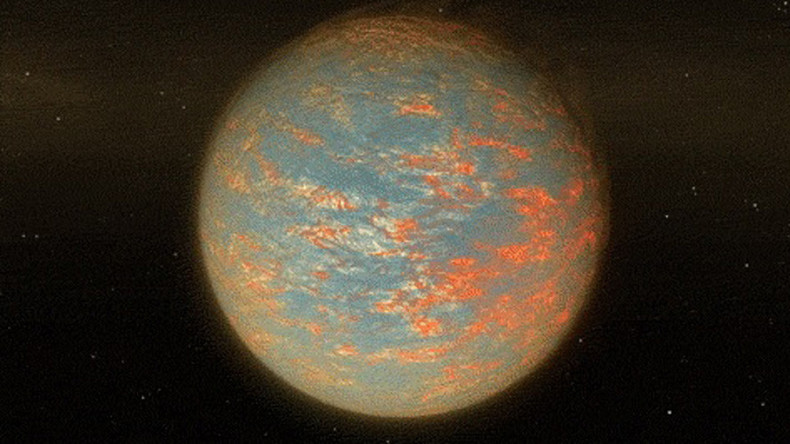
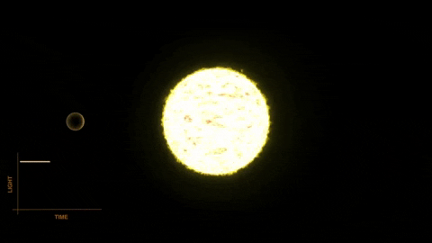

# Exoplanet Detection on NASA Keplar Telescope Data

A key focus of astronomical research is finding Earth-like exoplanets in habitable zones, areas around stars where conditions are just right for liquid water to exist. 
The search for exoplanets, planets beyond our solar system, is driven by questions about their existence, diversity, and potential for life. 

In this notebook, we will use `data science techniques` and `machine learning` to predict potential exoplanets in star systems using light intensity curves data derived from 
observations made by the NASA Kepler space telescope.

## 🌐 Table of Contents

- [Background](#-background)
- [Exploratory Data Analysis](#-exploratory-data-analysis)
- [Data Preprocessing](#-data-preprocessing)
- [Summary of Machine Learning Model Evaluation](#-summary-of-machine-learning-model-evaluation)
- [Observations](#-observations)
- [Built Using](#%EF%B8%8F-built-using)
- [Improvements](#%EF%B8%8F-improvements)
- [Contributors](#-contributors)

## 📜 Background

The [Keplar Dataset](https://www.kaggle.com/datasets/keplersmachines/kepler-labelled-time-series-data), publicly available from NASA, includes flux readings from over 3000 stars, 
each labelled as either housing an exoplanet or not. We will be analysing this data from the Kepler mission to identify potentially habitable exoplanets. 

As you can imagine, planets themselves do not emit light, but the stars that they orbit do. If the said star is watched over several months or years, there may be a regular 'dimming' 
of the flux (the light intensity). This is evidence that there may be an orbiting body around the star; such a star could be considered to be a 'candidate' system. Further study 
of our candidate system, for example by a satellite that captures light at a different wavelength, could solidify the belief that the candidate can in fact be 'confirmed'.

## 📈 Exploratory Data Analysis

### 1. Getting an idea about Class Distribution

Huge disproportion in the data: 99.3% not exoplanet while only 0.7% is an exoplanet.

### 2. Investigating Flux

We see clear periodic motion: We still see clear anomalies from detection errors, but there is periodic motion evident in all the plots. Even star 35 shows periodic motion, 
albeit on a smaller amplitude. This is due to the fact that there is a planet orbiting in front of the star periodically, therefore decreasing the flux received.

### 3. Distribution of Flux

Boxplots were created for different FLUX features against the 'LABEL' column to identify outliers. These plots help to visually detect outliers as points that lie beyond the whiskers 
of the boxplot.

## 🎬 Data Preprocessing

### 1. Handling Missing Values:

- A heatmap was generated using Seaborn to visualize any missing values in the dataset.
- The heatmap indicated that there are no missing values in the dataset.

### 2. Outlier Detection and Removal:

- Data points where 'FLUX.1' exceeded 250,000 were considered outliers and removed from the dataset.

### 3. Handling Imbalance using SMOTE (Synthetic Minority Oversampling Technique):

- SMOTE was employed to address the class imbalance issue in the dataset.
- This technique generates synthetic samples for the minority class, resulting in an equal number of observations for each class.
- After applying SMOTE, both classes (LABEL 1 and LABEL 0) had an equal count of 5049 samples.

### 4. Data Normalization:

- The normalization process was applied to the input features to scale the values to a common range without distorting differences in value ranges.
- This step is crucial for many algorithms to perform optimally.

### 5. Applying Gaussian Filters:

- Gaussian filters were used to smooth the input features.
- This step is based on the concept of the Gaussian distribution, commonly used in statistics and various sciences.

### 6. Feature Scaling:

- Feature scaling was performed using the StandardScaler.
- This step ensures that all input features have comparable ranges, which is important for many machine-learning algorithms.

### 7. Dimensionality Reduction using PCA (Principal Component Analysis):

- PCA was applied to reduce the dimensionality of the dataset while retaining 90% of the variance.
- The number of components required to retain this variance was determined to be 23.
- Finally, PCA was re-applied with 23 components to transform the dataset.

### 8. Splitting into Testing Data and Training Data:

- The processed dataset was split into training and testing sets.
- The split was done with a test size of 33% and a specific random state for reproducibility.

## 🔬 Summary of Machine Learning Model Evaluation

**Criteria:** Accuracy, Precision, Recall, and F1-Score.

### 1. K Nearest Neighbors (KNN)
   
   - **Accuracy:** 99.94%
   - **Precision, Recall, F1-Score:** 100% for both classes (0 and 1).

### 2. Logistic Regression
   
   - **Accuracy:** 99.97%
   - **Precision, Recall, F1-Score:** 100% for both classes.

### 3. Bernoulli Naive Bayes

   - **Accuracy:** 99.97%
   - **Precision, Recall, F1-Score:** 100% for both classes.

### 4. Decision Tree

   - **Accuracy:** 99.97%
   - **Precision, Recall, F1-Score:** 100% for both classes.

### 5. Random Forest

   - **Accuracy:** 100%
   - **Precision, Recall, F1-Score:** 100% for both classes.

### 6. XGBoost Classifier

   - **Accuracy:** 99.97%
   - **Precision, Recall, F1-Score:** 100% for both classes.

### 7. Artificial Neural Network

   - **Accuracy:** 99.94%
   - **Precision, Recall, F1-Score:** 100% for both classes.

## 👨‍🔬 Observations

- **High Performance:** All models displayed exceptionally high accuracy and perfect precision, recall, and F1 scores.
- **Consistency:** There was a remarkable consistency across different types of models in terms of performance metrics.

## ⛏️ Built Using

1. Languages: `Python`
2. Tools: `Jupyter Notebook`
3. Frameworks: `Numpy`, `Pandas`, `Seaborn`, `Matplotlib`, `Plotly`, `Scipy`, `Sklearn`, `Imblearn`, `Keras` and `XGBoost`.

## 🗺️ Future Work 

1. Explore more complex models, feature engineering techniques, and larger datasets to further enhance the detection of exoplanets.
2. Concerns about overfitting, especially in a real-world scenario where perfect prediction is rare.

## 👥 Contributors

<table>
  <tr>
    <td align="center">
       <a href="https://github.com/abhishek-x"> <b>Abhishek Aggarwal</b></a>
    </td>
    <td align="center">
       <a href="https://github.com/2707-Sakshi"> <b>Sakshi</b></a>
    </td>
  </tr>
</table>
